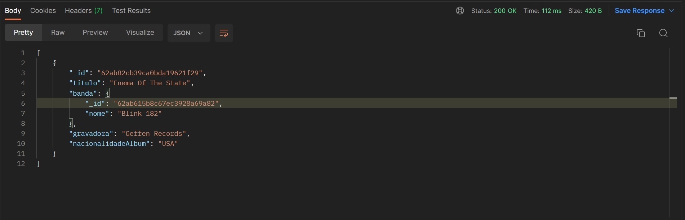
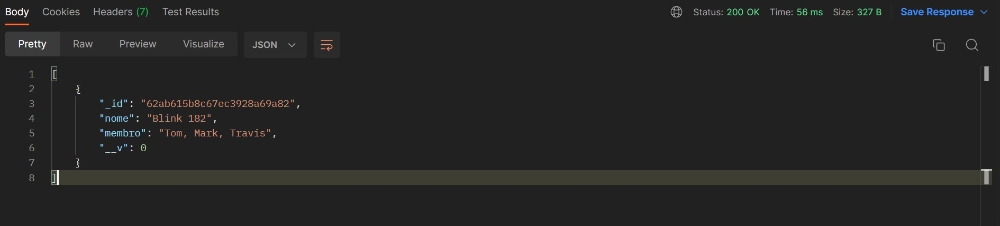

# NodeJS: API Rest com Express e MongoDB

Esse projeto trata de uma API desenvolvida com o curso de Node JS com Express e MongoDB da plataforma Alura. 

# Tecnologias Usadas
<ul>
    <li>NodeJS</li>
    <li>API Rest</li>
    <li>Express</li>
    <li>MongoDB</li>
    <li>Postman</li>
</ul>

# Estruturas Acrescentadas

 Para fins de estudos, foram acrescentadas as seguintes estruturas: 

<h2>Models</h2>
<ul>
    <li>Album</li>
    <li>Banda</li>
</ul>

<h2>Controllers</h2>
<ul>
    <li>albunsControllers</li>
    <li>bandasControllers</li>
</ul>

<h2>Routes</h2>
<ul>
    <li>albunsRoutes</li>
    <li>bandasRoutes</li>
</ul>

# Imagens
<h2>Tabela álbum </h2>
    
<h2>Tabela Banda</h2>
    